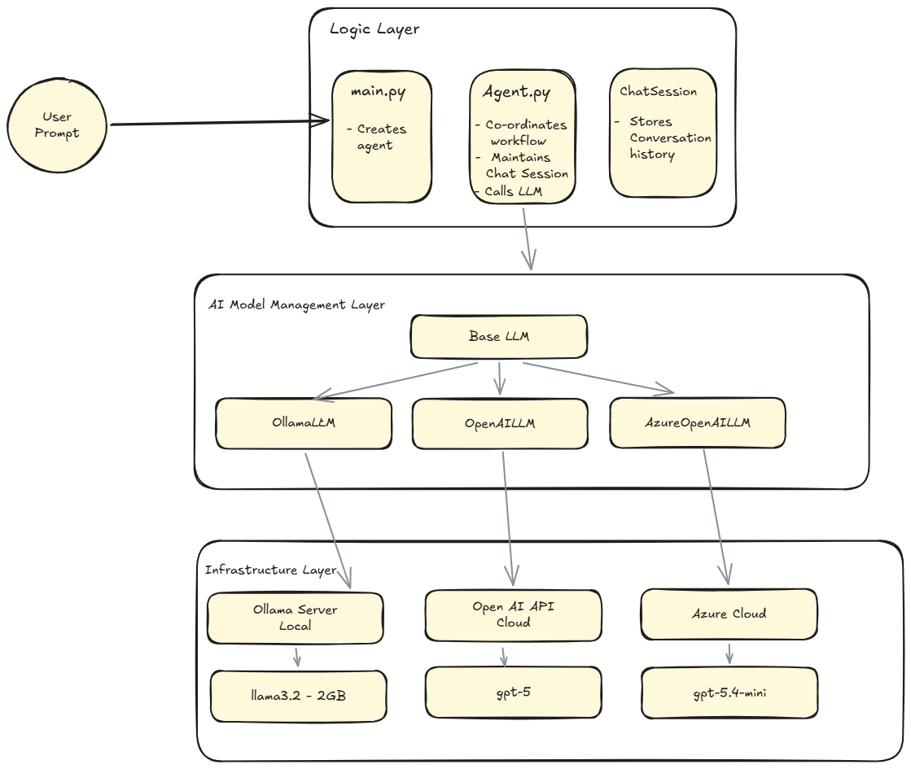

# Phase 1 - Local LLM/cloud LLM Integration and chat memory

## 📌 Project Overview

This phase demonstrates how to integrate a locally running Large Language Model (LLM) or cloud LLM into a Python application he objective -  Understand how applications communicate with an LLM without relying on cloud providers.

This phase  is the first milestone in a larger AI Agent Engineering roadmap that gradually evolves from a simple chat application into a production-grade multi-agent platform.


## Architecture




## Learning Objectives

After completing this phase, I should understand:

- How local LLMs work
- How Ollama exposes an HTTP API
- How Python communicates with an LLM
- Message-based conversations
- Prompt engineering basics
- Why LLMs are stateless
- Why abstraction layers are important

## Features

- Run Llama locally
- Interactive chat application
- Conversation history
- Object-oriented design
- Provider abstraction for easy provider replacement - Factory Design Pattern

## Project Structure

```text
AI_Financial_Agent/

├── llms/
│   ├── base.py
│   ├── ollama_llm.py
│   └── factory.py
│
├── agent/
│   ├── chat.py
│   └── agent.py
│
├── main.py
└── README.md
```

---

## Design Decisions

### Why use an abstraction layer?

Instead of directly calling Ollama everywhere in the project, a `BaseLLM` interface was introduced.

Benefits:

- Loose coupling
- Easier testing
- Open for extension
- Supports multiple providers

```text
Agent
   │
BaseLLM
   ▲
   │
OllamaLLM
OpenAILLM
AzureOpenAILLM
```

---

### Why use Object-Oriented Programming?

Responsibilities are separated into classes.

| Class | Responsibility |
|--------|----------------|
| Agent | Coordinates execution |
| ChatSession | Maintains conversation history |
| BaseLLM | Common interface |
| Ollama_LLM | Communicates with Ollama |
| OpenAI_LLM | Communicates with OpenAI |

This follows the Single Responsibility Principle.

---

## Tradeoffs

### Advantages

- Simple architecture
- Easy to understand
- Can run completely offline
- Easy to integrate models from other LLM providers

### Limitations

- No tool calling
- No memory beyond conversation history
- No planning
- No RAG
- No streaming responses
- No retry logic

--
## Challenges Faced

- Understanding message history
- Designing a provider abstraction - Factory Design Pattern
- Mechansim to setup

# What I Learned

- LLMs are stateless
- Python applications maintain memory
- Good architecture separates responsibilities
- Interfaces simplify future enhancements

# Future Improvements

Next phase will introduce:

- Tool calling
- Function registry
- ReAct reasoning
- Agent loop
- JSON responses
- Retry handling

# References

- Ollama Documentation
- linkedin.com/learning/building-ai-agents-for-beginners-by-microsoft
- https://learn.microsoft.com/en-us/credentials/certifications/azure-ai-apps-and-agents-developer-associate/?practice-assessment-type=certification
- https://microsoft.github.io/ai-agents-for-beginners/